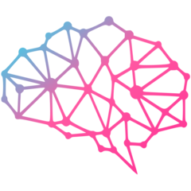

<div align="center">



# OneBrain

### Your AI Thinking Partner — for Obsidian.

<a href="https://onebrain.run"></a>
<a href="https://x.com/onebrain_run"></a>
<a href="https://www.npmjs.com/package/@onebrain-ai/cli"></a>
<a href="https://github.com/onebrain-ai/onebrain/stargazers"></a>

</div>

---

## What is OneBrain

A personal AI OS that lives inside your Obsidian vault. You teach it your context; it captures, organizes, and recalls — getting sharper the more you use it. Built natively on [Claude Code](https://claude.com/claude-code).

> Most tools ask you to query an AI. OneBrain co-evolves with you — every preference you teach sharpens the agent, every link it surfaces sharpens you.

```bash
npm install -g @onebrain-ai/cli
```

## How it works

1. **Initiate** — Install the CLI, run `/onboarding`. The agent learns your name, vault, and identity.
2. **Capture intent** — Talk in natural language. The agent writes, classifies, and links in real time. → `/braindump` · `/capture` · `/bookmark`
3. **Mutual evolution** — `/research` and `/distill` expand your knowledge. `/learn` deepens the agent. The loop tightens. → `/research` · `/distill` · `/learn`

## What's inside

- **◉ Persistent memory** — three layers: who you are, what you taught, what we decided. Carries across every session.
- **↘ Frictionless capture** — braindump, capture, bookmark. Pick whichever matches your thought.
- **◈ Semantic search** — qmd hybrid keyword + vector. Recall any idea in seconds.
- **⌘ Auto-linking** — every new note gets wikilinks pulled from your existing graph.
- **↯ Skills system** — 20+ slash commands wrap deep workflows like research, distill, weekly review.
- **▦ PARA-native** — ready-made structure for Projects, Areas, Resources, Knowledge.

## Projects

| Repo | What it is |
|---|---|
| [`onebrain`](https://github.com/onebrain-ai/onebrain) | CLI · Claude Code plugin · agent core (`@onebrain-ai/cli`) |
| [`website`](https://github.com/onebrain-ai/website) | Marketing site — [onebrain.run](https://onebrain.run) |

## Topics

`obsidian` · `claude-code` · `personal-ai` · `ai-agent` · `ai-os` · `pkm` · `second-brain` · `knowledge-base` · `note-taking` · `memory` · `markdown` · `local-first` · `personal-knowledge-management` · `gemini-cli` · `productivity`

---

<sub>OneBrain · hello@onebrain.run · [@onebrain_run](https://x.com/onebrain_run)</sub>
