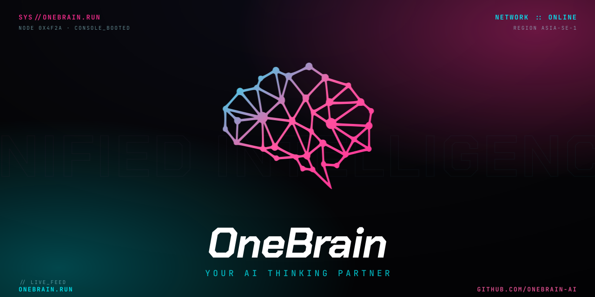

<div align="center">



### Your AI Thinking Partner — for Obsidian.

[Website](https://onebrain.run) · [@onebrain_run](https://x.com/onebrain_run) · [npm](https://www.npmjs.com/package/@onebrain-ai/cli)

</div>

---

## What is OneBrain

A personal AI OS that lives inside your Obsidian vault. You teach it your context; it captures, organizes, and recalls — getting sharper the more you use it. Built natively on [Claude Code](https://claude.com/claude-code).

```bash
npm install -g @onebrain-ai/cli
```

## Projects

| Repo | What it is |
|---|---|
| [`onebrain`](https://github.com/onebrain-ai/onebrain) | CLI · Claude Code plugin · agent core (`@onebrain-ai/cli`) |
| [`website`](https://github.com/onebrain-ai/website) | Marketing site — [onebrain.run](https://onebrain.run) |

## Built in Public

Follow the build at [@onebrain_run](https://x.com/onebrain_run) · `#BuildInPublic` `#Obsidian`

---

<sub>OneBrain · hello@onebrain.run</sub>
