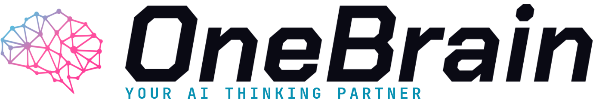

<div align="center">

<picture>
  <source media="(prefers-color-scheme: dark)" srcset="assets/header-dark.png">
  
</picture>

<a href="https://onebrain.run"></a>
<a href="https://x.com/onebrain_run"></a>

<a href="https://www.npmjs.com/package/@onebrain-ai/cli"></a>
<a href="https://github.com/onebrain-ai/onebrain/blob/main/CHANGELOG.md"></a>
<a href="https://github.com/onebrain-ai/onebrain/blob/main/LICENSE"></a>

</div>

---

## What is OneBrain

An AI OS that extends Claude Code, Gemini CLI, Codex, Qwen — adding persistent memory, 30+ skills, and personal calibration. Plain Markdown. Local-first. Yours forever.

> Most tools ask you to query an AI. OneBrain **co-evolves** with you — every preference you teach sharpens the agent, every link it surfaces sharpens you.

```bash
# macOS
brew install onebrain-ai/onebrain/onebrain

# any platform via npm
npm install -g @onebrain-ai/cli
```

---

<sub>OneBrain · hello@onebrain.run · [@onebrain_run](https://x.com/onebrain_run)</sub>
